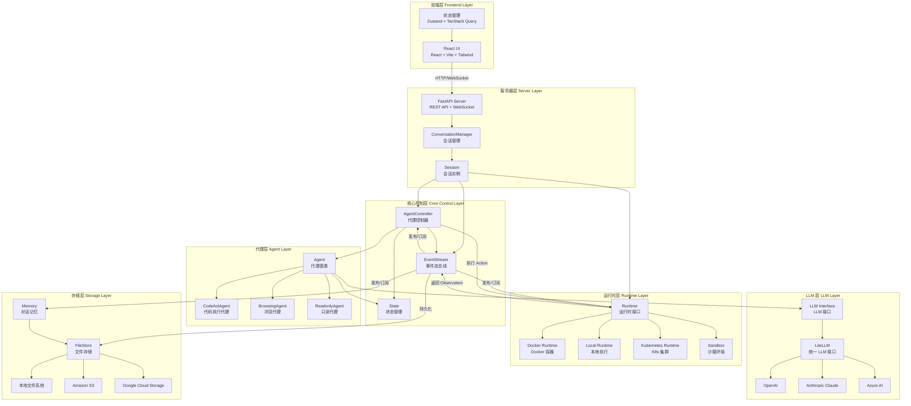
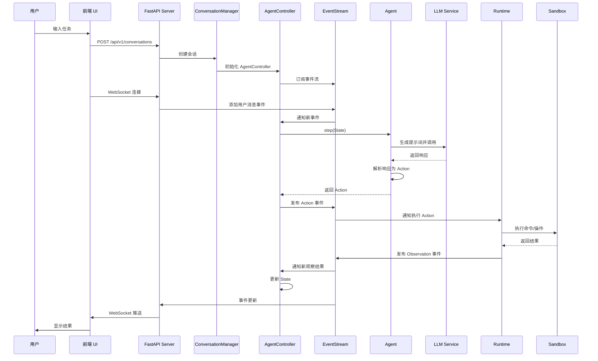
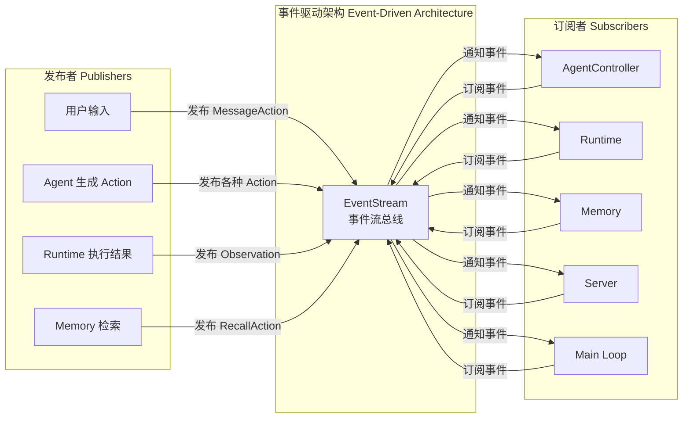
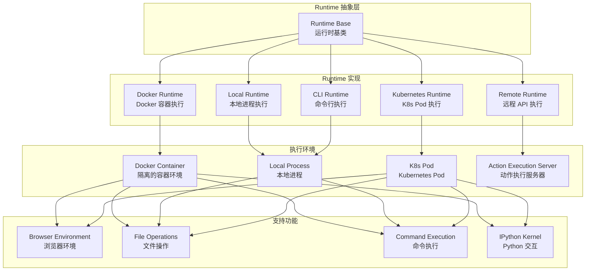
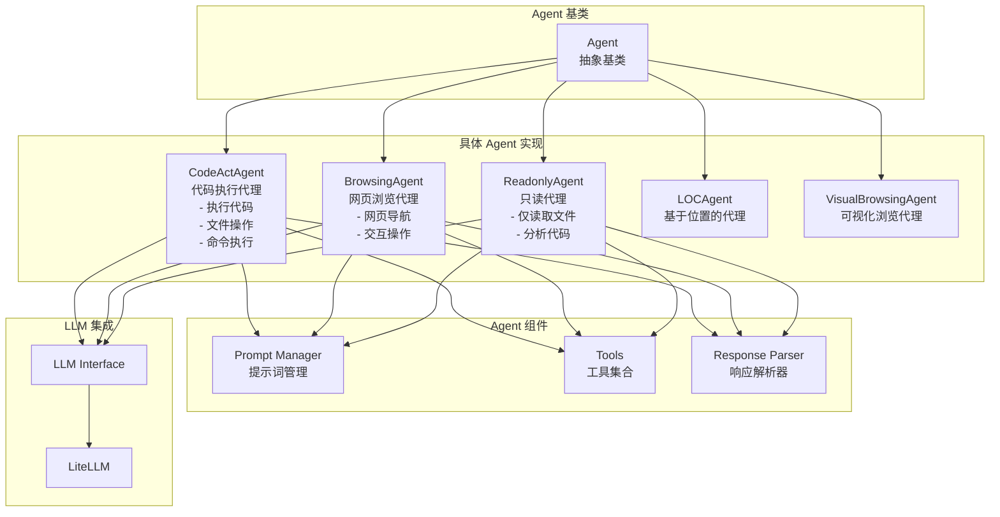
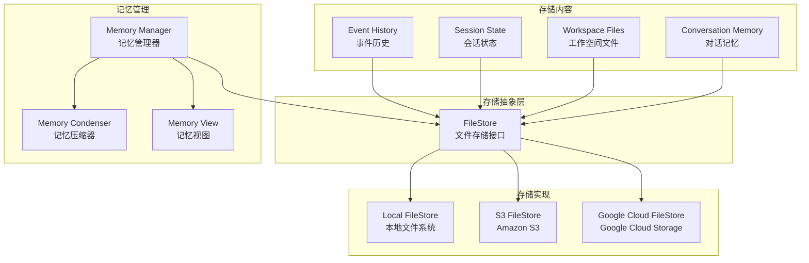
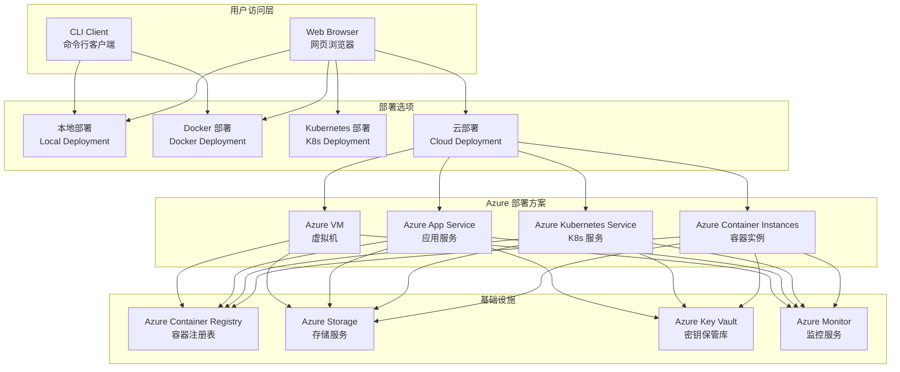

# OpenHands 项目架构总结

> **⚠️ Mermaid 图表渲染说明**:
>
> 如果您的预览器显示的是 Mermaid 代码而不是图表，请按以下方式解决：
>
> **VS Code 用户**:
> 1. 安装扩展：`Markdown Preview Mermaid Support` (作者: Matt Bierner)
> 2. 或安装：`Markdown Preview Enhanced` (功能更强大)
> 3. 按 `Ctrl+Shift+V` (Windows/Linux) 或 `Cmd+Shift+V` (Mac) 打开预览
>
> **其他编辑器**:
> - **Typora**: 原生支持，直接预览即可
> - **Obsidian**: 需要安装 "Mermaid" 插件
> - **GitHub/GitLab**: 在网页上查看，原生支持 Mermaid
> - **在线查看**: 复制 Mermaid 代码到 [Mermaid Live Editor](https://mermaid.live/) 查看
>
> **验证方法**: 如果看到的是渲染后的图表（而不是代码块），说明配置成功 ✅

## 1. 整体架构概述

OpenHands 项目采用现代化的前后端分离架构。它主要由一个基于 React 的单页应用前端和一个作为 AI 代理编排核心的模块化 Python 后端组成。

两者之间的通信主要通过 REST API 和 WebSocket 进行，形成一个标准的客户端-服务器（Client-Server）模型。该架构具有良好的解耦性，使得前端和后端可以独立开发和部署。

## 2. 主要组件

### a. 前端 (`frontend`)

- **职责**: 提供用户界面（UI），允许用户与 AI 代理进行交互、发起任务和可视化结果。
- **技术栈**:
  - **框架**: React
  - **构建工具**: Vite
  - **状态管理**: Zustand, Tanstack Query
  - **UI**: Tailwind CSS
- **通信**: 前端通过 HTTP 请求与后端 API (`/api/v1`) 进行通信。`frontend/src/api/open-hands-axios.ts` 文件是配置 API 请求客户端的核心。

### b. 后端 (`openhands`)

- **职责**: 作为项目的核心业务逻辑引擎。它负责处理来自前端的请求，通过 AI 模型（LLM）进行决策和内容生成，管理数据库，并在沙箱环境中执行代码。
- **技术栈**:
  - **框架**: FastAPI
  - **ORM**: SQLAlchemy
  - **LLM 集成**: `litellm` (用于连接不同的语言模型)
  - **沙箱环境**: Docker
- **结构**: 后端代码高度模块化，通过 `openhands/app_server/v1_router.py` 文件聚合了用户、会话、沙箱等不同功能的 API 路由，结构清晰。

### c. 企业版 (`enterprise`)

- **职责**: 根据目录结构和命名推断，此部分可能包含为 SaaS 或企业级部署设计的扩展功能，例如更高级的认证、多租户支持或特定的集成，它构建于 `openhands` 核心功能之上。

## 3. 技术栈总结

| 层次 | 技术 | 用途 |
| --- | --- | --- |
| **前端** | React, Vite | 构建用户界面 |
| | Zustand | 状态管理 |
| | Tailwind CSS | 样式与布局 |
| **后端** | Python, FastAPI | API 服务开发 |
| | SQLAlchemy | 数据库交互与 ORM |
| | `litellm` | 与多种 LLM 服务集成 |
| | Docker | 提供安全的代码执行沙箱 |

## 4. 通信模式

- **主要模式**: 客户端-服务器模式。
- **协议**:
  - **REST API**: 前端通过 `axios` 客户端向后端 FastAPI 服务发起 HTTP 请求，用于大多数数据交互。
  - **WebSocket**: 可能用于需要实时通信的功能，例如实时日志流或状态更新。

## 5. 系统架构图

### 5.1 整体架构图

### 5.2 数据流架构图

### 5.3 组件交互图

### 5.4 运行时架构图

### 5.5 Agent 类型架构图

### 5.6 存储架构图

### 5.7 部署架构图

